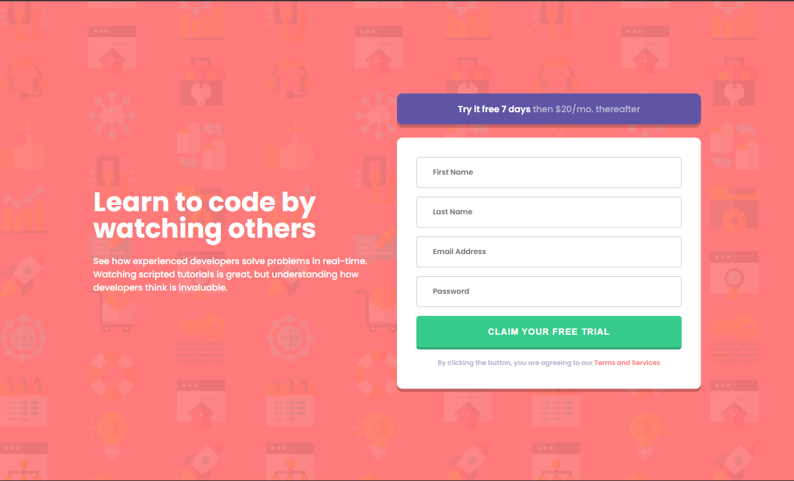
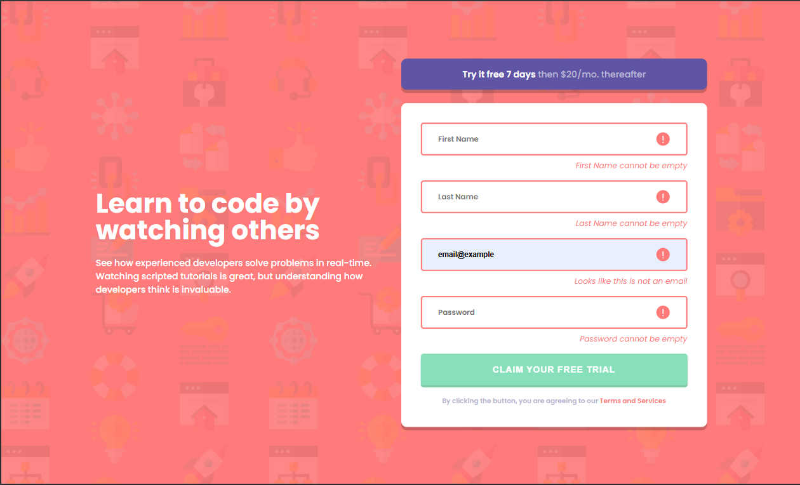

# Frontend Mentor - Intro component with sign-up form

Este proyecto es una solución al reto [Intro component with sign-up form](https://www.frontendmentor.io/challenges/intro-component-with-signup-form-5cf91bd49edda32581d28fd1). Los retos de Frontend Mentor te ayudan a mejorar tus habilidades de programación construyendo proyectos realistas.

Este es un reto de Frontend Mentor que consiste en crear un componente de introducción con un formulario de registro. El objetivo es replicar el diseño proporcionado y aplicar validaciones en el formulario usando HTML, CSS y JavaScript.

## Tabla de contenidos
- [Resumen](#resumen)
  - [El reto](#el-reto)
  - [Captura de pantalla](#captura-de-pantalla)
  - [Enlaces](#enlaces)
- [Mi proceso](#mi-proceso)
  - [Tecnologías utilizadas](#tecnologías-utilizadas)
  - [Lo que aprendí](#lo-que-aprendí)
  - [Recursos útiles](#recursos-útiles)
- [Autor](#autor)
- [Agradecimientos](#agradecimientos)

## Resumen

### El reto

Los usuarios deberían poder:

- Ver el diseño óptimo del sitio según el tamaño de la pantalla de su dispositivo
- Ver los estados hover para todos los elementos interactivos de la página
- Recibir un mensaje de error cuando se envía el `formulario` si:
  - Cualquier campo `input` está vacío. El mensaje para este error debe decir *"[Nombre del campo] no puede estar vacío"*
  - La dirección de correo electrónico no está correctamente formateada (es decir, una dirección válida debe tener esta estructura: `nombre@host.tld`). El mensaje para este error debe decir *"Parece que esto no es un correo electrónico"*

### Captura de pantalla

### Enlaces

- Solución: [GitHub](https://github.com/marco-moya/Intro-component-with-sign-up-form)
- Sitio en vivo: [GitHub Page](https://marco-moya.github.io/Intro-component-with-sign-up-form)

## Mi proceso

### Tecnologías utilizadas
- HTML5 semántico
- SCSS usando metodología BEM
- Flexbox y CSS Grid
- Mobile-first workflow
- JavaSCript

### Lo que aprendí
- Cómo estructurar el HTML usando BEM para facilitar el mantenimiento y la escalabilidad del CSS.
- Uso de SCSS para crear mixins reutilizables y variables de color.
- Implementación de layouts responsivos con Grid y Flexbox.
- Validar campos de un formulario usando expresiones regulares
- Manipular el DOM para agregar contenido de forma dinámica.

### Recursos útiles
- [Guía BEM](http://getbem.com/introduction/)
- [Documentación oficial de SCSS](https://sass-lang.com/guide)
- [Guía de CSS Grid](https://css-tricks.com/snippets/css/complete-guide-grid/)
- [Frontend Mentor](https://www.frontendmentor.io/resources)

## Autor
- Nombre: Marco Moya
- Frontend Mentor: [@marco-moya](https://www.frontendmentor.io/profile/marco-moya)

## Agradecimientos
Gracias a la comunidad de Frontend Mentor por los recursos y feedback. Inspiración visual tomada del diseño original del reto.